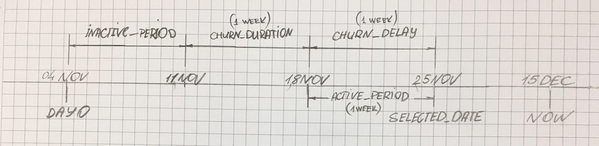

# Purchases API and Dashboard
Configurable insights about users and purchases.

## Insights
Dashboard provides information about users activity and purchases
based on the date selected by user and configuration options in [config](/config.js). Please find queries explanation in [scripts directory](/scripts/).



### Users activity
Depending on user behaviour and configuration options, dashboard highlights three types of users: active, churned and inactive.

##### Active
User is considered active when he made `X` purchases during last `Y` days/weeks/months. See [query explanation](/scripts/ActiveBuyers.js).
```javascript
X = config.activitySettings.activePurchases
Y = config.activitySettings.activePeriod
```

##### Churned
User is considered churned on a day when his _last purchase_ was between `X` and `Y`. See [query explanation](/scripts/ChurnedUSers.js).
```javascript
X = SELECTED_DATE - config.activitySettings.churnDelay
Y = SELECTED_DATE - config.activitySettings.churnDelay - config.activitySettings.churnDuration
```

#### Inactive
User is considered inactive when his _last purchase_ was earlier than churning start point `X`. See [query explanation](/scripts/InactiveUsers.js).
```javascript
X = SELECTED_DATE - config.activitySettings.churnDelay - config.activitySettings.churnDuration
```

### Purchases statistics
Dashboard displays number of users who made purchases on selected day, on that’s day week and month, and in period from that day till today.

---

## Tools and technologies
### Backend
- Node.js and Express
- MongoDB Native Node.js driver
- ava.js for testing

### Frontend
- React with help of `create-react-app`
- SCSS

Frontend part is located in separate repository [meetfrank-assignment-frontend](https://github.com/sergetymo/meetfrank-assignment-frontend).

## Installation, running and testing
### Prerequisites
```bash
$ node -v
v10.13.0

$ mongo --version
MongoDB shell version v3.6.3

$ yarn -v
1.12.3
```

### Installation
1. First, install dependencies: `yarn`.
2. Make sure your `mongod` is up and running.
3. Then restore database from dump: `yarn restore`.

### Running
1. `yarn start`
2. Visit [http://localhost:3000](http://localhost:3000)

### Testing
1. `yarn test`

---

## Demo
[Demo video](scripts/demo.mp4)

---

## Further improvements
### Fix date selecting on iOS
For simplicity now user selects desired date using `<input type="date">`. On iOS Safari, native datepicker lacks support for `min` and `max` attributes. When user picks date that is out of available data boundaries, it just reverts to first or last available date.

### Improve caching mechanism
For simplicity, all heavily calculated data is cached and stored in `app.locals`. There’re definitely better cache storage choices.

### Provide trends on activity stats
There’s possibility to provide some kind of trend information about user activity, e.g. _number of active users dropped by 4%_.

### Elaborate more metrics
Like activity rate or churn rate
